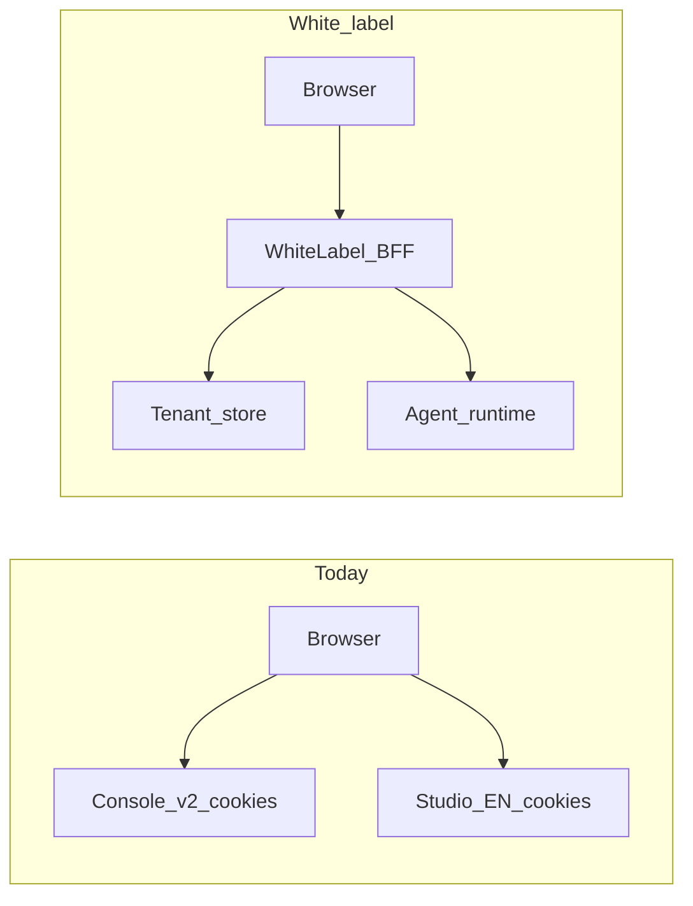

# White-label backend API contract (custom-studio-app)

This document is for **backend engineers** building a **white-label / micro-SaaS** API that replaces today’s coupling to Agora Console session cookies and split gateways. It lists **logical capabilities** the custom-studio-app UI needs, **why** each exists, and **payload/contract expectations** aligned with frontend types.

## Relationship to other docs

| Document | Role |
|----------|------|
| [`api.text`](./api.text) | Verbose catalog of **today’s** Agora Studio EN + Console paths, curl samples, and response dumps. Use it for **example payloads** until the app ships TypeScript types for every field. |
| [`../lib/types/api.ts`](../lib/types/api.ts) | **Canonical request/response shapes** the app uses for agents, integration, projects, and global call history. |
| [`../lib/types/analytics-api.ts`](../lib/types/analytics-api.ts) | Call **analytics** overview/analysis payloads for Observe → Analytics (`CallOverviewData`, `CallAnalysisData`). |
| [`docs/plan/`](./plan/) | Feature implementation plans; this file is the **BE handoff** checklist for those features. |

**White-label note:** Path prefixes (e.g. `/api/v1/studio/en/...` vs `/api/v2/...`) may change behind your gateway. JSON **field names and semantics** should stay compatible with the types above unless product agrees to break them.

## Today vs white-label

**Today (Agora wrapper):**

- **Studio EN** — `axiosStudio` base from `NEXT_PUBLIC_API_STUDIO_BASE_URL` (see [`../lib/mock-api-bases.ts`](../lib/mock-api-bases.ts)). Relative paths like `/agent-pipeline`, `/resources`.
- **Console v2** — `axiosConsoleV2` for `/projects` (list/create). Base from `NEXT_PUBLIC_API_CONSOLE_V2_BASE_URL` or derived from the Studio base.
- **Auth** — Browser session (cookies), tenant implied by **company / cid** on the server side.

**White-label target:**

- Prefer a **single authenticated API surface** (BFF or API gateway): e.g. `Authorization: Bearer <token>` or API key, optional `X-Tenant-Id` / org claim in the token.
- You may **merge** “Studio” and “Console project” concepts into one namespace; the UI only needs stable **operations** (list agents, create project, etc.).

---

## Response envelope

Several integration routes are normalized with [`unwrapStudioData`](../lib/utils/studio-response.ts): success when `code === 0` and payload in `data`, otherwise the raw body is treated as the payload (mock mode).

**BE should either:**

1. Return `{ "code": 0, "data": <T> }` for those resources, or  
2. Document a **single agreed envelope** and update the app’s unwrap logic once.

Agent-pipeline list/detail responses are consumed as returned by axios (see services); align list shapes with `PaginatedResponse` patterns in [`api.ts`](../lib/types/api.ts).

---

## Implemented in custom-studio-app (required for current screens)

Paths below are **relative** to the Studio EN base **except** where noted as **Console v2**.

### 1. Studio access gate

| Method | Path (today) | Purpose | UI |
|--------|----------------|---------|-----|
| GET | `/studio/allowed-entries` | Whether the tenant may use Studio features (`isAllowedStudioEntry`). | Bootstrap / `useStudioGate` |

**Contract:** Response includes `code` and `data.isAllowedStudioEntry` (see [`studio-auth.ts`](../lib/services/studio-auth.ts)).

---

### 2. Agent pipelines and editor

| Method | Path (today) | Purpose | UI |
|--------|----------------|---------|-----|
| GET | `/agent-pipeline` | Paginated list; filters: `keyword`, `page`, `page_size`, `status`, `sort_field`, `sort_order`. | `/dashboard/agents` |
| POST | `/agent-pipeline` | Create pipeline (from scratch or template). Body: [`CreateAgentPipelineRequest`](../lib/types/api.ts) (`name`, `description?`, `type`, `vid?`, `template_id?`, `graph_data?`, …). | Create Agent modal |
| GET | `/agent-pipeline/:id` | Load one pipeline for editor. | `/dashboard/agents/[id]/edit` |
| PUT | `/agent-pipeline/:id` | Save draft. Body: [`UpdateAgentPipelineRequest`](../lib/types/api.ts) (`name?`, `description?`, `graph_data?`, `graph_data_params_config?`, …). | Agent editor |
| DELETE | `/agent-pipeline/:id` | Delete pipeline. | Agents table actions |
| POST | `/agent-pipeline/:id/deploy` | Publish / deploy. Body: [`DeployAgentPipelineRequest`](../lib/types/api.ts) — `vids: string[]`, optional `note`, `graph_data`. | Deploy dialog |
| POST | `/agent-pipeline/:projectId/start` | Start preview session. Body: [`StartAgentPreviewRequest`](../lib/types/api.ts) (RTC channel/token wiring in `graph_data.properties`). | Service layer; Test panel wiring optional |
| DELETE | `/agent-pipeline/:projectId/:agentId/stop` | Stop preview. | Service layer |
| GET | `/agent-pipeline/:id/edit-status` | Whether pipeline is editable; inbound/outbound flags. Returns [`PipelineEditStatus`](../lib/types/api.ts). | Service layer |

---

### 3. Deployed agents (list + status)

| Method | Path (today) | Purpose | UI |
|--------|----------------|---------|-----|
| GET | `/agent-deploy-pipeline` | Paginated deployed pipelines. Query: `keyword`, `page`, `page_size`, `status` (optional). Response: `list`, `total`, optional `page` / `page_size`. Items: [`DeployedAgent`](../lib/types/api.ts) (`pipeline_deploy_uuid` is the **`agent_uuid`** for campaigns). | Campaign create/edit — AI agent dropdown |
| PUT | `/agent-deploy-pipeline/:project_id/:deploy_id/status` | Body: `{ status: number }`. | [`use-agents`](../hooks/use-agents.ts) mutations |

**White-label:** Same field semantics if paths are namespaced per tenant.

---

### 4. Agent templates

| Method | Path (today) | Purpose | UI |
|--------|----------------|---------|-----|
| GET | `/agent-templates` | Query: `page`, `page_size`, `keyword`, `type`. Response: `list` + `total` (template items include `graph_data`). | Create Agent — template picker |

---

### 5. Projects (Console v2 today)

| Method | Path (today) | Purpose | UI |
|--------|----------------|---------|-----|
| GET | `/projects` | Query: `fetchAll=true` optional. Response: [`ProjectListResponse`](../lib/types/api.ts) (`items`, `total`). | Create Agent — project dropdown |
| POST | `/project` | Body: [`CreateProjectRequest`](../lib/types/api.ts) — `enableCertificate`, `projectName`, `useCaseId`. Response: [`CreateProjectResponse`](../lib/types/api.ts). | Create Agent — new project |

**White-label:** These may become `/tenants/:id/projects` or similar; keep the same **fields** or document migrations.

---

### 6. Credentials (Studio resources)

| Method | Path (today) | Purpose | UI |
|--------|----------------|---------|-----|
| GET | `/resources` | Query: `source` (default `user_upload`), `type`, `vendor`, `keyword`, `page`, `page_size`, `sort`, `category`. | `/dashboard/integration/credentials` |
| POST | `/resources` | Body: [`CreateStudioResourceRequest`](../lib/types/api.ts). | Create credential modal |
| PUT | `/resources/:resourceId` | Body: [`UpdateStudioResourceRequest`](../lib/types/api.ts). | Edit flows |
| DELETE | `/resources/:resourceId` | Delete credential. | Table actions |

---

### 7. Knowledge bases

| Method | Path (today) | Purpose | UI |
|--------|----------------|---------|-----|
| GET | `/knowledge-bases` | Query: `page`, `page_size`, `search`. | `/dashboard/integration/knowledge-bases` |
| POST | `/knowledge-bases` | **multipart/form-data**: `name`, `description?`, file field `files` (repeated). | Create KB modal |
| DELETE | `/knowledge-bases/:id` | Delete KB. | Table actions |

**Note:** Document upload/detail/deployments endpoints exist in [`api.text`](./api.text) for full parity; the app currently uses list/create/delete only.

---

### 8. MCP servers

| Method | Path (today) | Purpose | UI |
|--------|----------------|---------|-----|
| GET | `/mcps` | Query: `page`, `page_size`, `search`, `status`, `sort_field`, `sort_order`. | `/dashboard/integration/mcps` |
| POST | `/mcp` | Body: [`CreateMcpRequest`](../lib/types/api.ts) (`name`, `description?`, `config`: `endpoint`, `transport`, `timeout_ms`, optional `headers` / `queries`). | Create MCP modal |
| PUT | `/mcp/:uuid` | Body: [`UpdateMcpRequest`](../lib/types/api.ts). | Edit MCP |
| DELETE | `/mcp/:uuid` | Delete server. | Table actions |

**Note:** `GET /mcp/:uuid`, `.../status`, `.../tools` are in [`api.text`](./api.text) for detail/health UX; not yet called by this app.

---

### 9. SIP / phone numbers (outbound-only)

Purpose: register E.164-style caller IDs with **outbound** SIP trunk settings. **Inbound** calling, **inbound agent binding**, and **associated agent** fields are **out of product scope** for custom-studio-app: the UI does not surface agent linkage, and requests send **`config.outbound_configs` only** (see types in [`api.ts`](../lib/types/api.ts)). Out dialing works from campaigns or APIs using this number’s id regardless of any optional agent fields a legacy API might return.

The list row `id` is the **`phone_number_id`** for outbound campaign and telephony APIs (see **Campaign linkage** below).

| Method | Path (today) | Purpose | UI |
|--------|----------------|---------|-----|
| GET | `/sip-numbers` | Paginated list. Query: `page`, `page_size`, `keyword` (optional). Response: `list`, `total`, optional `page` / `page_size`. Items: [`SipNumber`](../lib/types/api.ts). | `/dashboard/phone-numbers` |
| GET | `/sip-numbers/:id` | Single number (detail). | [`sip-number`](../lib/services/sip-number.ts) service |
| POST | `/sip-numbers` | Create. Body [`CreateSipNumberRequest`](../lib/types/api.ts): `number`, `source` (e.g. `twilio`), `description`, `config`: `{ outbound_configs: { address, transport, user?, password? } }`. | Add phone number sheet |
| PUT | `/sip-numbers/:id` | Update. Body [`UpdateSipNumberRequest`](../lib/types/api.ts): `description?`, `config?` (same outbound shape). Phone number is immutable in UI after create. | Edit sheet |
| DELETE | `/sip-numbers/:id` | Delete number. | Delete confirmation |
| GET | `/sip-numbers/all/edit-status` | Pre-delete guard: repeated `phone_number_ids`. Response: `{ id, editable }[]` per [`SipNumberEditStatusItem`](../lib/types/api.ts). | Before delete |
| GET | `/sip-numbers/all/call-history/overview` | Analytics KPIs and trend series for the selected period. Query: `from_time`, `to_time` (Unix seconds, recommended), `campaign_ids` (comma-separated), `agent_uuids` (comma-separated), **`call_type`** (`inbound` \| `outbound`), **`time_granularity`** (`day`), optional `timezone` (IANA). Response envelope with `data`: [`CallOverviewData`](../lib/types/analytics-api.ts). | `/dashboard/analytics` |
| GET | `/sip-numbers/all/call-history/analysis` | Status distribution and rate trends. **Same query params** as overview. Response `data`: [`CallAnalysisData`](../lib/types/analytics-api.ts) (`inbound_analysis` and/or `outbound_analysis`). | `/dashboard/analytics` |
| GET | `/sip-numbers/all/call-history` | Paginated **global** call log (all numbers). Query: `call_type` (`all` \| `inbound` \| `outbound`), `from_time`, `to_time`, `search_keyword`, `page`, `page_size`, `sort_by`, `sort_order`, optional filters (`agent_uuids`, `agent_name`, `campaign_ids`, `campaign_name`, `from_number`, `to_number`, repeated `call_category`, `call_duration_operator` + `call_duration`). Response: [`CallHistoryResponse`](../lib/types/api.ts). | `/dashboard/call-history` |
| GET | `/sip-numbers/call-history/:call_id` | Single-call detail for transcript, evaluation blobs, recording URL. Response: [`CallDetailByCallIdResponse`](../lib/types/api.ts). | Campaign results & global call history — row → detail sheet |

**Not used by this app (do not require for white-label parity here):** [`api.text`](./api.text) inbound SIP routes — e.g. bind/unbind inbound agent on a number, `GET /inbound-agent/sip-numbers/:phone_number_id`, `inbound_configs` / `inbound_agent_config` on create/update. A full Agora-style backend may still implement those for other clients; this UI and [`CreateSipNumberRequest`](../lib/types/api.ts) omit them.

The UI labels the vendor as **“SIP Trunk”** while sending `source: "twilio"`.

**Campaign linkage:** Outbound campaigns use **`phone_number_id`** — the SIP number **`id`** from `GET` / `POST /sip-numbers`. Populate the caller-number selector from this list.

---

### 10. Metadata (system evaluations)

| Method | Path (today) | Purpose | UI |
|--------|----------------|---------|-----|
| GET | `/metadata/system-evaluations` | Returns built-in evaluation variable names/types for post-call extraction. Response: [`SystemEvaluationsResponse`](../lib/types/api.ts). | Campaign create/edit — “Post call data extraction” |

---

### 11. Campaign (outbound)

Purpose: list/create/update/delete campaigns, upload recipient CSV, run metrics, per-campaign call history, CSV exports, interrupt running jobs, redial cohorts. Types: [`CreateCampaignRequest`](../lib/types/api.ts), [`CampaignDetails`](../lib/types/api.ts), [`CampaignSummary`](../lib/types/api.ts), [`CampaignCallHistoryItem`](../lib/types/api.ts), export responses.

**Recipient CSV:** Must include `phone_number` (E.164). Extra columns become prompt variables. **Limits:** Agora documents **25 MB** and **50,000** rows; if your product uses another cap, document it in your gateway and match UI copy.

| Method | Path (today) | Purpose | UI |
|--------|----------------|---------|-----|
| GET | `/campaigns` | List. Query: `page`, `page_size`, `search_keyword`, `search_fields` (e.g. `campaign_name,phone_number,agent_name`), `campaign_ids`, `agent_uuids`, `phone_number_ids`, `status`, `sort_by`, `sort_order`. | `/dashboard/campaign` |
| POST | `/campaigns/recipients/upload` | **multipart/form-data** field `file` (CSV). Response: `{ file_url }` used as `recipients_file_url` on create/update. | Create / edit |
| POST | `/campaigns` | Body [`CreateCampaignRequest`](../lib/types/api.ts): `agent_uuid`, `campaign_name`, `is_send_immediately`, `phone_number_id`, `recipients_file_url`, optional `call_interval_ms`, `scheduled_start_time`, `timezone`, `hangup_configuration`, `scheduled_time_ranges_config`, `switch_configuration`, `llm_call_evaluation_configuration`, `sip_transfer`. | Create |
| GET | `/campaigns/:campaign_id` | Full config for edit header. [`CampaignDetails`](../lib/types/api.ts). | Edit + results header |
| PUT | `/campaigns/:campaign_id` | Body [`UpdateCampaignRequest`](../lib/types/api.ts) (same logical fields as create, all required per Agora shape). | Edit scheduled campaigns |
| DELETE | `/campaigns/:campaign_id` | Remove campaign. | List actions |
| POST | `/campaigns/:campaign_id/interrupt` | Stop an in-progress campaign. | List / results |
| GET | `/campaigns/:campaign_id/summary` | Aggregate metrics for cards + donut. [`CampaignSummary`](../lib/types/api.ts). | Results |
| GET | `/campaigns/:campaign_id/call-history` | Paginated calls. Query: `page`, `page_size`, `search_keyword`, `call_category`, `sort_by`, `sort_order`, time filters as supported. | Results table |
| GET | `/campaigns/template/export` | CSV string (contact template). | Create — download template |
| GET | `/campaigns/:campaign_id/summary/export` | CSV string (results summary). | Results — download |
| GET | `/campaigns/:campaign_id/call-history/export` | CSV string; same filter query params as call-history where applicable. | Results |
| GET | `/campaigns/:campaign_id/redial/export` | Query: `call_category` comma-separated cohort keys (`no_answer`, `human_answered`, `voicemail`, `failed`, `outbound_transferred_success`, `outbound_transferred_failed`, …). CSV for selected cohorts. | Redial modal |

**Semantics notes:**

- **`switch_configuration`:** `enable_user_auto_hangup` ≈ end-of-conversation hangup; `enable_voicemail` ≈ voicemail detection; `enable_max_silence_duration_hangup` + `hangup_configuration.max_silence_duration_seconds`; `enable_transcript` / `enable_recording`; `enable_llm_call_evaluation` drives post-call extraction (`llm_call_evaluation_configuration`).
- **`scheduled_time_ranges_config`:** Array of `{ weekday, time_ranges: [{ start, end }] }` for call windows (local times interpreted with `timezone`).
- **Redial:** Cohort counts in UI come from **`CampaignSummary`**; export uses **`redial/export`** with selected categories.

**Optional (full call-modal parity):** Events and latency tabs in Agora Studio use debugging APIs, e.g. `GET /debugging/tasks/:task_id/detail` and `GET /debugging/tasks/:task_id/events` with a time window — see [`api.text`](./api.text). custom-studio-app phase 1 uses **call-by-id** detail only.

---

## Maintenance (repo rule)

Whenever you add or change a **user-facing feature** that calls the backend (new integration type, campaign UI, phone numbers, etc.):

1. Update **this file** with the full set of logical APIs (method, purpose, payload/response notes).  
2. Add or update the matching file under [`docs/plan/`](./plan/) for implementation tracking.  
3. Keep [`api.text`](./api.text) as the long-form reference for Agora-equivalent samples.

See also [`.cursor/rules/plan-documentation.mdc`](../.cursor/rules/plan-documentation.mdc).
