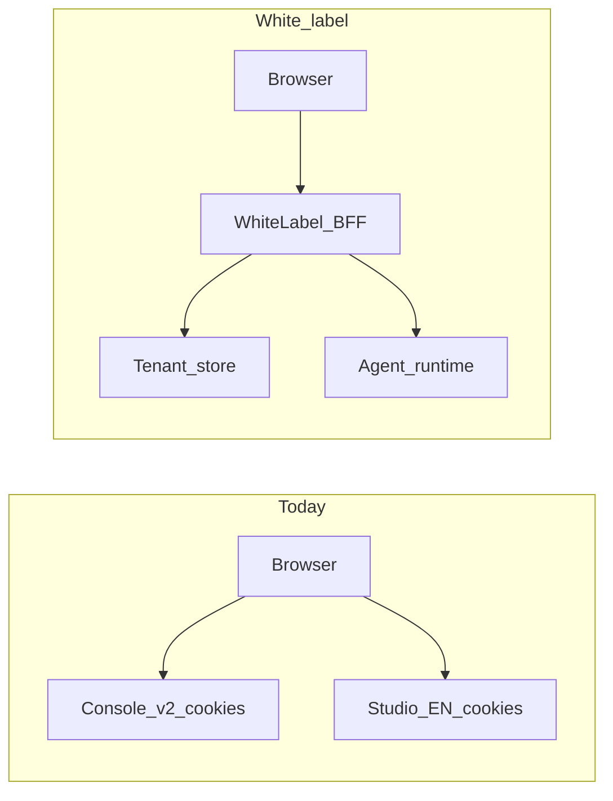

# White-label backend API contract (custom-studio-app)

This document is for **backend engineers** building a **white-label / micro-SaaS** API that replaces today’s coupling to Agora Console session cookies and split gateways. It lists **logical capabilities** the custom-studio-app UI needs, **why** each exists, and **payload/contract expectations** aligned with frontend types.

## Relationship to other docs

| Document | Role |
|----------|------|
| [`api.text`](./api.text) | Verbose catalog of **today’s** Agora Studio EN + Console paths, curl samples, and response dumps. Use it for **example payloads** until the app ships TypeScript types for every field. |
| [`../lib/types/api.ts`](../lib/types/api.ts) | **Canonical request/response shapes** the app uses for agents, integration, and projects. |
| [`docs/plan/`](./plan/) | Feature implementation plans; this file is the **BE handoff** checklist for those features. |

**White-label note:** Path prefixes (e.g. `/api/v1/studio/en/...` vs `/api/v2/...`) may change behind your gateway. JSON **field names and semantics** should stay compatible with the types above unless product agrees to break them.

## Today vs white-label

**Today (Agora wrapper):**

- **Studio EN** — `axiosStudio` base from `NEXT_PUBLIC_API_STUDIO_BASE_URL` (see [`../lib/mock-api-bases.ts`](../lib/mock-api-bases.ts)). Relative paths like `/agent-pipeline`, `/resources`.
- **Console v2** — `axiosConsoleV2` for `/projects` (list/create). Base from `NEXT_PUBLIC_API_CONSOLE_V2_BASE_URL` or derived from the Studio base.
- **Auth** — Browser session (cookies), tenant implied by **company / cid** on the server side.

**White-label target:**

- Prefer a **single authenticated API surface** (BFF or API gateway): e.g. `Authorization: Bearer <token>` or API key, optional `X-Tenant-Id` / org claim in the token.
- You may **merge** “Studio” and “Console project” concepts into one namespace; the UI only needs stable **operations** (list agents, create project, etc.).

---

## Response envelope

Several integration routes are normalized with [`unwrapStudioData`](../lib/utils/studio-response.ts): success when `code === 0` and payload in `data`, otherwise the raw body is treated as the payload (mock mode).

**BE should either:**

1. Return `{ "code": 0, "data": <T> }` for those resources, or  
2. Document a **single agreed envelope** and update the app’s unwrap logic once.

Agent-pipeline list/detail responses are consumed as returned by axios (see services); align list shapes with `PaginatedResponse` patterns in [`api.ts`](../lib/types/api.ts).

---

## Implemented in custom-studio-app (required for current screens)

Paths below are **relative** to the Studio EN base **except** where noted as **Console v2**.

### 1. Studio access gate

| Method | Path (today) | Purpose | UI |
|--------|----------------|---------|-----|
| GET | `/studio/allowed-entries` | Whether the tenant may use Studio features (`isAllowedStudioEntry`). | Bootstrap / `useStudioGate` |

**Contract:** Response includes `code` and `data.isAllowedStudioEntry` (see [`studio-auth.ts`](../lib/services/studio-auth.ts)).

---

### 2. Agent pipelines and editor

| Method | Path (today) | Purpose | UI |
|--------|----------------|---------|-----|
| GET | `/agent-pipeline` | Paginated list; filters: `keyword`, `page`, `page_size`, `status`, `sort_field`, `sort_order`. | `/dashboard/agents` |
| POST | `/agent-pipeline` | Create pipeline (from scratch or template). Body: [`CreateAgentPipelineRequest`](../lib/types/api.ts) (`name`, `description?`, `type`, `vid?`, `template_id?`, `graph_data?`, …). | Create Agent modal |
| GET | `/agent-pipeline/:id` | Load one pipeline for editor. | `/dashboard/agents/[id]/edit` |
| PUT | `/agent-pipeline/:id` | Save draft. Body: [`UpdateAgentPipelineRequest`](../lib/types/api.ts) (`name?`, `description?`, `graph_data?`, `graph_data_params_config?`, …). | Agent editor |
| DELETE | `/agent-pipeline/:id` | Delete pipeline. | Agents table actions |
| POST | `/agent-pipeline/:id/deploy` | Publish / deploy. Body: [`DeployAgentPipelineRequest`](../lib/types/api.ts) — `vids: string[]`, optional `note`, `graph_data`. | Deploy dialog |
| POST | `/agent-pipeline/:projectId/start` | Start preview session. Body: [`StartAgentPreviewRequest`](../lib/types/api.ts) (RTC channel/token wiring in `graph_data.properties`). | Service layer; Test panel wiring optional |
| DELETE | `/agent-pipeline/:projectId/:agentId/stop` | Stop preview. | Service layer |
| GET | `/agent-pipeline/:id/edit-status` | Whether pipeline is editable; inbound/outbound flags. Returns [`PipelineEditStatus`](../lib/types/api.ts). | Service layer |

---

### 3. Deployed agent status (pause / resume style)

| Method | Path (today) | Purpose | UI |
|--------|----------------|---------|-----|
| PUT | `/agent-deploy-pipeline/:project_id/:deploy_id/status` | Body: `{ status: number }`. | [`use-agents`](../hooks/use-agents.ts) mutations |

---

### 4. Agent templates

| Method | Path (today) | Purpose | UI |
|--------|----------------|---------|-----|
| GET | `/agent-templates` | Query: `page`, `page_size`, `keyword`, `type`. Response: `list` + `total` (template items include `graph_data`). | Create Agent — template picker |

---

### 5. Projects (Console v2 today)

| Method | Path (today) | Purpose | UI |
|--------|----------------|---------|-----|
| GET | `/projects` | Query: `fetchAll=true` optional. Response: [`ProjectListResponse`](../lib/types/api.ts) (`items`, `total`). | Create Agent — project dropdown |
| POST | `/project` | Body: [`CreateProjectRequest`](../lib/types/api.ts) — `enableCertificate`, `projectName`, `useCaseId`. Response: [`CreateProjectResponse`](../lib/types/api.ts). | Create Agent — new project |

**White-label:** These may become `/tenants/:id/projects` or similar; keep the same **fields** or document migrations.

---

### 6. Credentials (Studio resources)

| Method | Path (today) | Purpose | UI |
|--------|----------------|---------|-----|
| GET | `/resources` | Query: `source` (default `user_upload`), `type`, `vendor`, `keyword`, `page`, `page_size`, `sort`, `category`. | `/dashboard/integration/credentials` |
| POST | `/resources` | Body: [`CreateStudioResourceRequest`](../lib/types/api.ts). | Create credential modal |
| PUT | `/resources/:resourceId` | Body: [`UpdateStudioResourceRequest`](../lib/types/api.ts). | Edit flows |
| DELETE | `/resources/:resourceId` | Delete credential. | Table actions |

---

### 7. Knowledge bases

| Method | Path (today) | Purpose | UI |
|--------|----------------|---------|-----|
| GET | `/knowledge-bases` | Query: `page`, `page_size`, `search`. | `/dashboard/integration/knowledge-bases` |
| POST | `/knowledge-bases` | **multipart/form-data**: `name`, `description?`, file field `files` (repeated). | Create KB modal |
| DELETE | `/knowledge-bases/:id` | Delete KB. | Table actions |

**Note:** Document upload/detail/deployments endpoints exist in [`api.text`](./api.text) for full parity; the app currently uses list/create/delete only.

---

### 8. MCP servers

| Method | Path (today) | Purpose | UI |
|--------|----------------|---------|-----|
| GET | `/mcps` | Query: `page`, `page_size`, `search`, `status`, `sort_field`, `sort_order`. | `/dashboard/integration/mcps` |
| POST | `/mcp` | Body: [`CreateMcpRequest`](../lib/types/api.ts) (`name`, `description?`, `config`: `endpoint`, `transport`, `timeout_ms`, optional `headers` / `queries`). | Create MCP modal |
| PUT | `/mcp/:uuid` | Body: [`UpdateMcpRequest`](../lib/types/api.ts). | Edit MCP |
| DELETE | `/mcp/:uuid` | Delete server. | Table actions |

**Note:** `GET /mcp/:uuid`, `.../status`, `.../tools` are in [`api.text`](./api.text) for detail/health UX; not yet called by this app.

---

## Planned features (not in UI yet; scope for BE)

Use [`api.text`](./api.text) for full paths and curl bodies until types land in the repo.

### Campaign

Purpose: outbound campaign management, recipients, publish/interrupt, call summaries and exports, redial, evaluation metadata.

Logical groups (see **Campaign** section in `api.text`):

- CRUD + list + get detail  
- Draft publish, interrupt, delete  
- Recipients CSV upload  
- Summary, exports, redial exports and analytics  
- Per-campaign call history and exports  
- System/custom evaluation metadata endpoints used by campaign flows  

### SIP / phone numbers

Purpose: provision numbers, bind inbound to deployed agents, call history, exports, overview/analysis.

Logical groups (see **SIP** section in `api.text`):

- CRUD on SIP numbers  
- Bind/unbind inbound agent to deployment  
- Inbound config lookup by phone  
- Call detail, global call history, export, filter options, overview, analysis  
- SIP edit-status polling  

When you add **Campaign** or **Phone / SIP** screens to custom-studio-app, extend the tables above with exact methods and align [`api.ts`](../lib/types/api.ts).

---

## Maintenance (repo rule)

Whenever you add or change a **user-facing feature** that calls the backend (new integration type, campaign UI, phone numbers, etc.):

1. Update **this file** with the full set of logical APIs (method, purpose, payload/response notes).  
2. Add or update the matching file under [`docs/plan/`](./plan/) for implementation tracking.  
3. Keep [`api.text`](./api.text) as the long-form reference for Agora-equivalent samples.

See also [`.cursor/rules/plan-documentation.mdc`](../.cursor/rules/plan-documentation.mdc).
