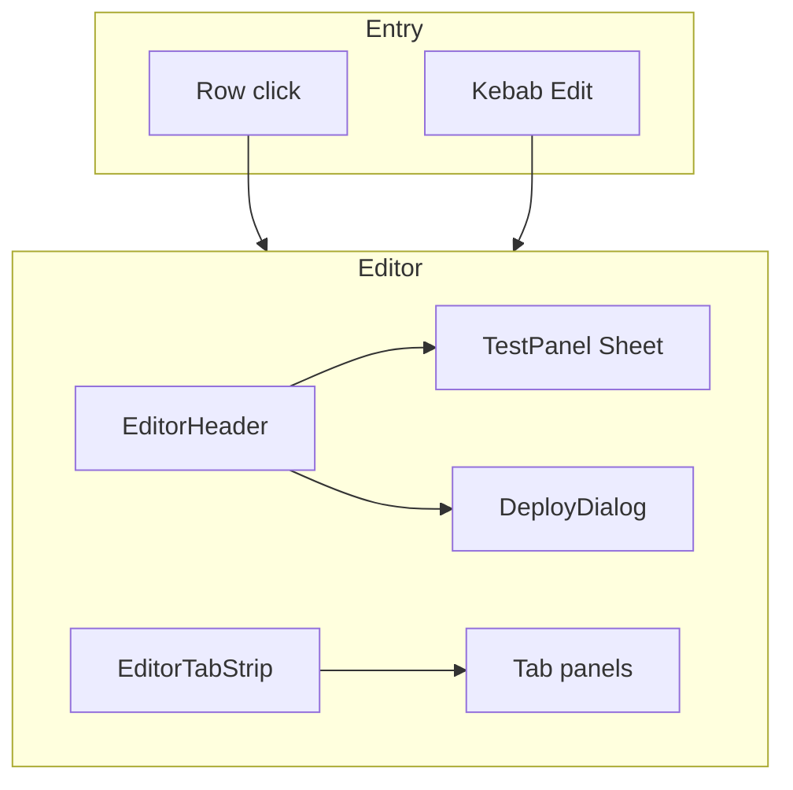

# Agent Editor Page

**Status:** Implemented (see codebase).  
**Route:** `/dashboard/agents/[pipelineId]/edit`  
**Related:** [Publish your agent — Agora Docs](https://docs.agora.io/en/conversational-ai/studio/deploy/deploy-agent), [Customize your agent](https://docs.agora.io/en/conversational-ai/studio/build/customize-agent)

**White-label / BE contract:** Editor load/save/deploy maps to pipeline APIs in [docs/White_label_api.md](../White_label_api.md). [docs/api.text](../api.text) stays the verbose Agora reference; white-label gateways may use different URL prefixes with the same JSON shapes.

## Purpose

Full-screen agent configuration workspace mirroring Agent Studio concepts: Prompt, Models, Advanced, Actions, Code tabs; Test panel (sheet); Deploy / Republish dialog. Entry from `/dashboard/agents` via row click or kebab **Edit**.

## Architecture

## File map

| Area | Path |
|------|------|
| Route | `app/(dashboard)/dashboard/agents/[pipelineId]/edit/page.tsx` |
| Shell + fetch + save | `components/agents/editor/agent-editor-shell.tsx` |
| State | `components/agents/editor/editor-types.ts` (`useReducer`) |
| Header | `components/agents/editor/editor-header.tsx` |
| Tabs | `components/agents/editor/editor-tab-strip.tsx` |
| Prompt | `components/agents/editor/prompt-tab.tsx` |
| Models | `components/agents/editor/models-tab.tsx` |
| Advanced | `components/agents/editor/advanced-tab.tsx` |
| Actions | `components/agents/editor/actions-tab.tsx` |
| Code | `components/agents/editor/code-tab.tsx` |
| Test | `components/agents/editor/test-panel.tsx` |
| Deploy | `components/agents/editor/deploy-dialog.tsx` |
| List entry | `components/agents/agents-page-client.tsx` |
| Types | `lib/types/api.ts` (`GraphData`, `GraphDataParamsConfig`, deploy/start types) |
| API | `lib/services/agent-pipeline.ts` (`getAgentPipeline`, `deployAgentPipeline`, preview helpers) |
| MSW | `mocks/handlers/agent-pipeline.ts` |

## Data flow

- Load: `GET /agent-pipeline/:id` → hydrate reducer.
- Save: `PUT /agent-pipeline/:id` with `name`, `description`, `graph_data` (Save when dirty).
- Deploy: `POST /agent-pipeline/:id/deploy` with `vids`, optional `note`.

## Design

- Tokens: `--studio-*` + semantic shadcn vars; light/dark via existing theme.
- Motion: `studio-reveal`, `studio-scale-in`, `studio-copy-check` in `app/globals.css`.

## Future work (optional)

- Wire Test panel to real `start` / `stop` preview APIs with channel/token.
- Persist `graph_data_params_config` on save if backend expects structured prompt mode.
- Toast / error UX on save and deploy failures.
