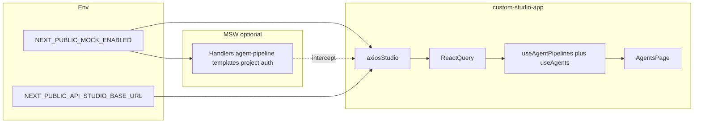

# Custom Studio App: Agents tab + API/mock parity

**Scope:** All implementation work for this effort happens **only** in [custom-studio-app](../../) (this Next.js app). [convo-ai-studio](https://github.com/) (or your internal clone) is a **reference** for types, hooks, mocks, and API shapes—not a dependency or shared package.

**API reference in-repo:** [docs/api.text](../api.text)

**White-label / BE contract:** For a future tenant-owned API (paths may differ from Agora), see [docs/White_label_api.md](../White_label_api.md). It lists logical operations, payloads aligned with `lib/types/api.ts`, and planned Campaign/SIP scope; `api.text` remains the detailed Agora sample dump.

---

## Context (locked decisions)

- **MergedAgent**: Full parity with convo-ai-studio `hooks/use-agents.ts` expansion rules (draft = no deployments; live/paused = per `deployments[]` or `deploy_app_ids` / `deploy_uuids` / `deploy_vids` fallback).
- **Create flow**: Real `POST /agent-pipeline` through the client (MSW when `NEXT_PUBLIC_MOCK_ENABLED=true`), not local-only fake state.
- **Contracts**: Reuse vid/project concepts; API surface matches `docs/api.text` (agent-pipeline, agent-templates, agent-deploy-pipeline).
- **Standalone**: Copy/port types, services, hook logic, mock handlers, and fixture data into custom-studio-app—no symlink or workspace dependency on convo-ai-studio.
- **Identifying prefix**: Express as part of the **Studio EN API base URL** (path segment under your gateway), not scattered per-route strings. Relative paths from services stay `/agent-pipeline`, `/agent-templates`, etc., as in convo.

---

## How convo derives URLs (mirror this pattern)

- **Production:** `NEXT_PUBLIC_API_STUDIO_BASE_URL` = full base for Studio EN routes (includes `/api/v1/studio/en` or your wrapper path, e.g. `https://gateway.example.com/<your-prefix>/api/v1/studio/en`).
- **Mock:** Same-origin base so the service worker can intercept; `NEXT_PUBLIC_MOCK_ENABLED` and optional `MOCK_SSR_ORIGIN` for SSR/Node. Reference: convo-ai-studio `lib/utils/mock-api-bases.ts`.

custom-studio-app should implement **two-mode** `getStudioAxiosBases()`: when mock is on, base = `origin +` configured path (same path segment as production so mock and prod never drift).

---

## MSW and Next standalone

- Add `msw`, `@tanstack/react-query`, and `axios` as needed.
- Port handler patterns from convo-ai-studio mocks: `agent-pipeline`, `templates`, `project`, `auth` (`allowed-entries`).
- Replace hardcoded `*/api/v1/studio/en/...` with **one constant** aligned with axios `baseURL` (e.g. `*${STUDIO_EN_PATH}/agent-pipeline`).
- **Service worker:** Prefer `/mockServiceWorker.js` at app root (no `/studio` basePath unless you add one); set `Service-Worker-Allowed: /` in `next.config` if needed for scope.
- **Dev script:** `scripts/run-dev.mjs` only runs `next dev`; mock is **only** `NEXT_PUBLIC_MOCK_ENABLED=true` in `.env.local` (same as Vercel). No separate `APP_MODE`.

---

## Data and types layer

- `lib/types/api.ts` (subset): `PaginationParams`, `PaginatedResponse`, `APIResponse`, `GraphData` (minimal), `BasePipeline`, `AgentPipeline`, list/create params, template/project types for Create Agent. Optional `deployments[]` on `AgentPipeline` for MergedAgent parity.
- `lib/types/entities.ts` (or merged): `LocalAgentPipeline` extending `AgentPipeline` (slim vs convo UI extras as you prefer).
- **Services:** Port agent-pipeline service functions (list, create, delete, rename, …) against one `axiosStudio` instance.
- **Data:** `getPipelines` + `convertAgentPipelineToLocal`.
- **Utils:** Port `hasPipelineDeployments`, `getPipelineStatus` from convo `lib/utils/pipeline-status.ts`.

---

## Hooks and gating

- Port `useAgentPipelines` + query keys; replace `allowedEntriesVerifiedAtom` with a small bootstrap (`GET .../studio/allowed-entries` mocked) or a single Jotai atom.
- Port `useAgents` + `MergedAgent` and mutations needed for v1 table actions.

---

## Fixture data (standalone)

- Copy convo `mocks/data/agent-pipelines.ts` into custom-studio-app mocks; fix imports to local types.
- Optionally add `deployments[]` on sample rows for agent id / status coverage.

---

## UI (custom design language)

- Route e.g. `app/(dashboard)/dashboard/agents/page.tsx` + table using existing shadcn/ui.
- Columns: name, agent id, project/app id (masked), last published, last edited, status, actions.
- **Pagination:** Parity with convo—API `total` is **pipelines**; UI may show **more rows than page_size** when one pipeline expands to multiple deployments.
- Create Agent modal: projects (V2 mock), region (static mock unless API exists), name, templates; submit matches convo create payload shape.

---

## Env contract

| Variable | Role |
|----------|------|
| `NEXT_PUBLIC_MOCK_ENABLED` | `true` → MSW + mock-origin axios bases |
| `NEXT_PUBLIC_API_STUDIO_BASE_URL` | Production: full axios base for relative `/agent-pipeline` paths |
| `NEXT_PUBLIC_STUDIO_EN_PATH` or derive from base | Path for MSW wildcards + mock base (must match) |
| `MOCK_SSR_ORIGIN` | SSR origin in mock mode |

---

## Verification

- **Mock on:** List, search, pagination, expanded rows, Create Agent + refetch.
- **Mock off:** Same UI against real/wrapper base (cookies/CORS as needed).

---

## Implementation checklist

- [x] Env vars + axios clients (`lib/mock-api-bases.ts`, `lib/api/clients.ts`)
- [x] Types subset + `LocalAgentPipeline` + agent-pipeline service + `lib/data/pipelines.ts`
- [x] MSW (browser + `instrumentation.ts` server), `public/mockServiceWorker.js`, handlers + fixtures
- [x] `useAgentPipelines` + `useAgents` + pipeline-status + `useStudioGate` (allowed-entries)
- [x] Agents page UI (`/dashboard/agents`) + Create Agent modal + sidebar link
- [x] `scripts/run-dev.mjs` + `pnpm local` + `.env.example`

---

## Diagram

