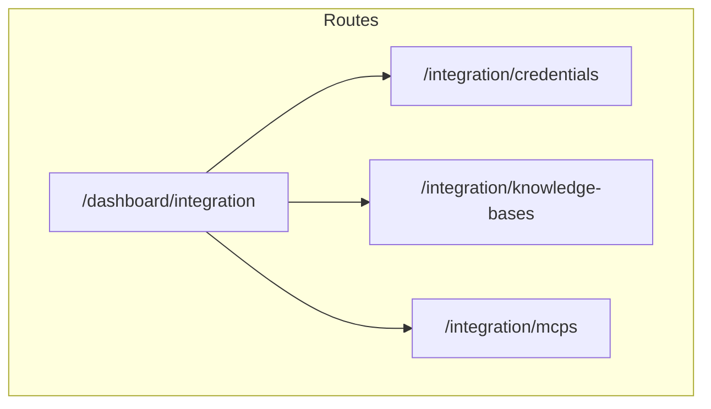

# Integration tab plan (custom-studio-app)

## Status (as of last update)

| Layer | State | Notes |
|--------|--------|--------|
| Types + response unwrap | Done | Integration DTOs in [`lib/types/api.ts`](../../lib/types/api.ts); [`lib/utils/studio-response.ts`](../../lib/utils/studio-response.ts) |
| Services | Done | [`lib/services/resources.ts`](../../lib/services/resources.ts), [`knowledge-bases.ts`](../../lib/services/knowledge-bases.ts), [`mcp.ts`](../../lib/services/mcp.ts) |
| Query keys | Done | [`lib/query-keys.ts`](../../lib/query-keys.ts) — `integrationKeys`, normalizers |
| Hooks | Done | [`hooks/use-resources.ts`](../../hooks/use-resources.ts), [`use-knowledge-bases.ts`](../../hooks/use-knowledge-bases.ts), [`use-mcps.ts`](../../hooks/use-mcps.ts) |
| Credential presets (phase 1) | Done | [`lib/integration/credential-presets.ts`](../../lib/integration/credential-presets.ts) |
| MCP transport labels | Done | [`lib/integration/mcp-transport.ts`](../../lib/integration/mcp-transport.ts) |
| MSW + fixtures | Done | [`mocks/handlers/resources.ts`](../../mocks/handlers/resources.ts), [`knowledge-bases.ts`](../../mocks/handlers/knowledge-bases.ts), [`mcp.ts`](../../mocks/handlers/mcp.ts); data under [`mocks/data/`](../../mocks/data/) |
| Dashboard routes + shell | Done | [`app/(dashboard)/dashboard/integration/`](../../app/(dashboard)/dashboard/integration/) + [`integration-shell.tsx`](../../components/integration/integration-shell.tsx) |
| UI components + modals | Done | [`components/integration/`](../../components/integration/) — hub, tab clients, create modals |
| Sidebar link | Done | [`components/dashboard-sidebar.tsx`](../../components/dashboard-sidebar.tsx) — **Integration** |

---

## Overview

Add a dashboard **Integration** area for **Credentials** (Studio `/resources` with `source=user_upload`), **Knowledge bases**, and **MCP servers**, aligned with [docs/api.text](../api.text) and [Agora — Manage integrations](https://docs.agora.io/en/conversational-ai/studio/build/integrations). Styling uses app tokens (`--studio-*`, Syne/Outfit) and shadcn—not a pixel copy of Agora Console.

## Reference (convo-ai-studio)

- Segmented tabs + toolbar + table: `app/integration/[type]/page.tsx`, `components/integration/*`, `components/modals/credential-modal.tsx` (dynamic fields from `serviceMetaData`).
- Use as **behavioral** reference only.

## API surface (api.text)

| Area | Endpoints |
|------|-----------|
| Credentials | `GET/POST /resources`, `GET/PUT/DELETE /resources/{resource_id}` |
| Knowledge bases | `GET/POST /knowledge-bases`, `PUT/DELETE /knowledge-bases/:id`, documents APIs |
| MCP | `POST /mcp`, `GET /mcps`, `GET/PUT/DELETE /mcp/:uuid`, `status`, `tools` |

Notes: resources list uses `source=user_upload`, `type`, `vendor`, `keyword`, `page`, `page_size`. KB create uses **multipart/form-data**. MCP `config.transport`: `streamable_http` \| `http` \| `sse` (responses may show `SHTTP`—normalize for display).

## Information architecture

- **Hub** at `/dashboard/integration`: intro + three feature cards linking to lists.
- **Sub-routes** `/dashboard/integration/credentials`, `knowledge-bases`, `mcps` with shared **tab strip** (includes **Overview** for hub).
- Per section: search, Add, table, pagination, delete (and create modals).

## Component / file map

**UI (shipped):**

- [`integration-shell.tsx`](../../components/integration/integration-shell.tsx), [`integration-hub.tsx`](../../components/integration/integration-hub.tsx)
- Tab clients: `credentials-tab-client.tsx`, `knowledge-bases-tab-client.tsx`, `mcps-tab-client.tsx`
- Modals: `create-credential-modal.tsx`, `create-knowledge-base-modal.tsx`, `create-mcp-modal.tsx`

**Data / mock:**

- `lib/services/*`, hooks, `lib/integration/*`, MSW handlers + fixtures

## Credentials (phase 1)

Curated `(type_key, vendor)` → `resource_data` keys from api samples (e.g. OpenAI LLM: `api_key`, `base_url`; Microsoft ASR: `key`, `region`, `language`). Full `serviceMetaData` parity is optional later.

## Verification

- **Mock on:** hub, tabs, lists, search, pagination, create/delete flows (once UI is merged).
- **Mock off:** real gateway (cookies/CORS).

## Implementation checklist

- [x] Routes + `integration-shell` tabs + hub
- [x] Services + types + React Query hooks + query keys
- [x] MSW handlers (KB multipart on wire; mock accepts `FormData`)
- [x] Tab clients + modals + sidebar link

